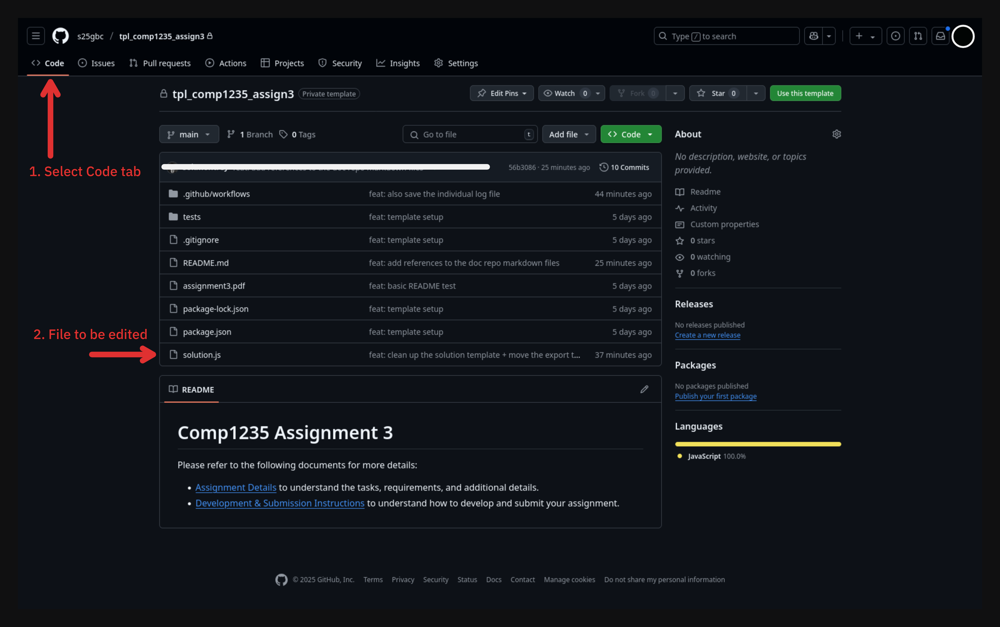
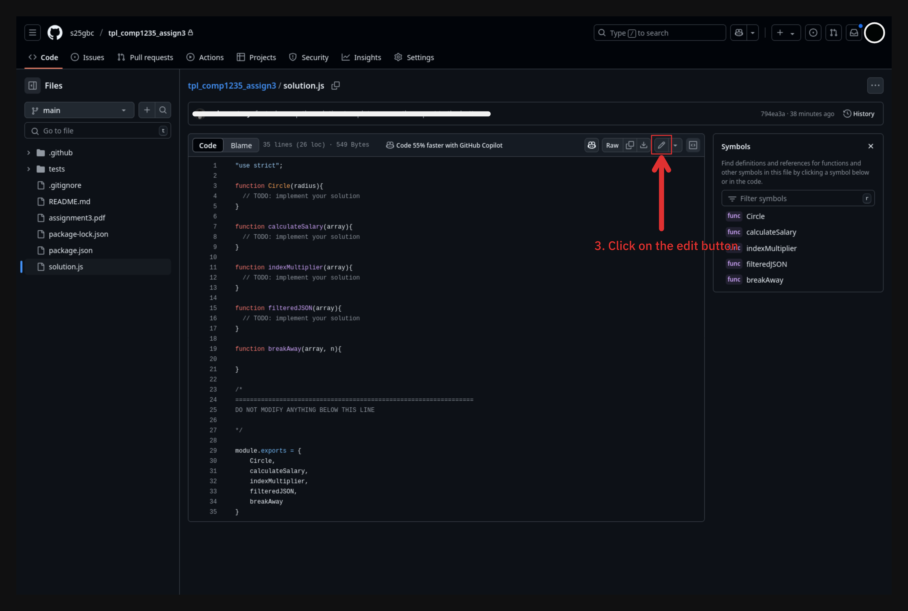
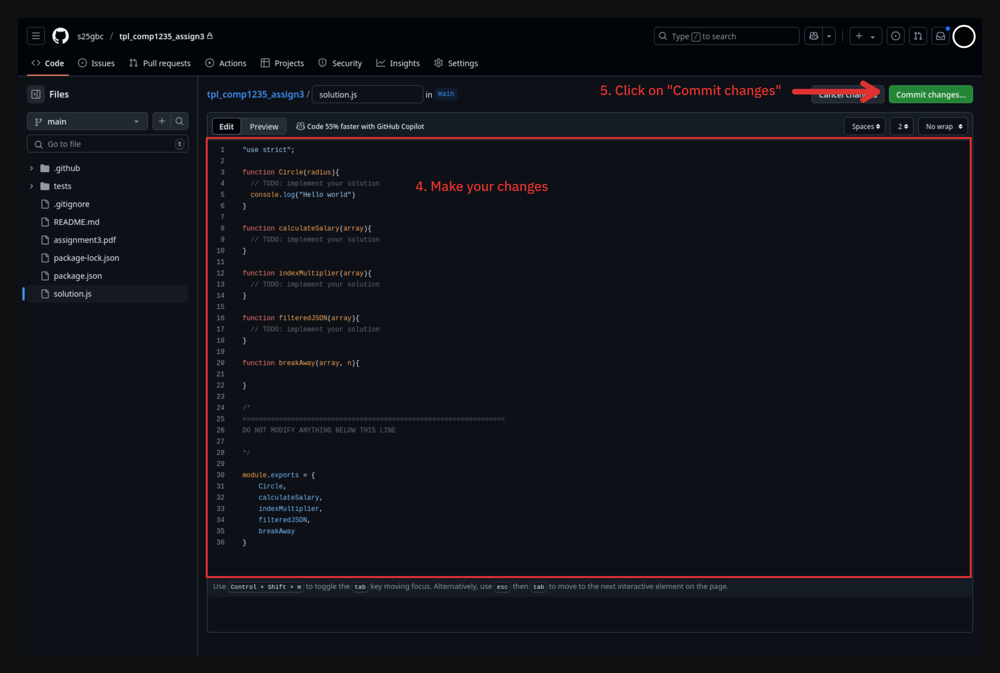
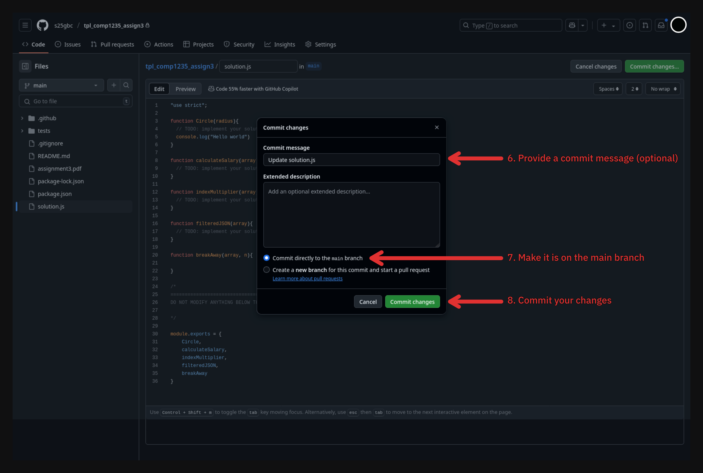
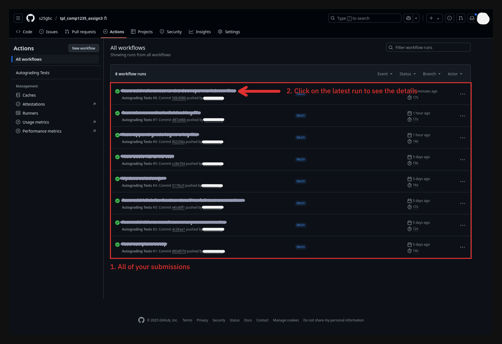
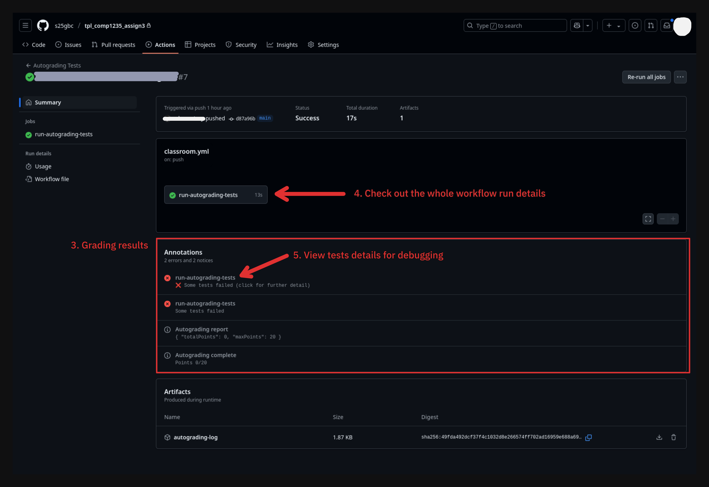

# Assignment 4 - Development and Submissions Instructions

Once accepting the assingment, you will have a copy of the assignment repository under your GitHub account with the GBC GitHub organization. Follow the provided link to navigate to your assingment repository.

## Development Environment

You have two options to work on this assignment:

1. Use the GitHub interface to modify the files in the repository directly.
2. Clone the repository to your local machine and use your preferred IDE to modify the files (**recommended for large assignments**).

### Option 1: Using GitHub Interface

In your respository, under the `Code` tab, select the file you want to modify and click on the `Edit` button. This will open the file in the GitHub interface. You can then modify the file and click on the `Commit changes` button to save your changes. Commit messages is optional, but it is recommended to provide a meaningful commit message and even add a description.

Please refer to the [Grading Results and Debugging](#grading-results-and-debugging) section for more information.

### Option 2: Local Development

We advised you to learn more about Git version control system and how to use it to manage your code. The general flow is as follows:

1. Clone the repository to your local machine. (`git clone <repository_url>`)
2. Open the cloned code in your preferred IDE (e.g. VSCode, WebStorm, etc.).
3. Install the dependencies. (`npm install`)
4. Make changes to the codes.
5. Run the tests to ensure your code is working as expected. (`npm run test`)
6. Commit your changes on your local machine. (`git add .`)
7. Push your changes to the remote repository. (`git push origin main`)

Steps 4, 5 are usually repeated as you continue to develop and debug the assignment.

You can also skip step 5 and let GitHub action run the auto-grading for you. Make sure the commit your changes and push them to your remote repository (step 6 and 7). Please refer to the [Grading Results and Debugging](#grading-results-and-debugging) section for more information.

## Grading Results and Debugging

Select the `Actions` tab to view all the auto-grading runs. Select the top most run to view the latest grading results and details.

> **Note:** The auto-grading runs are triggered by the `Push` event. This means that the auto-grading will run every time you push your changes to the repository.

> **IMPORTANT:** The workflow run might indicate a success even if your test results are still failing. Select the run to view the auto-grading results and details before finishing your assignment.

You can see the grading summary under the `Annotations` section. For further details, you can select the run to view the auto-grading script output.

